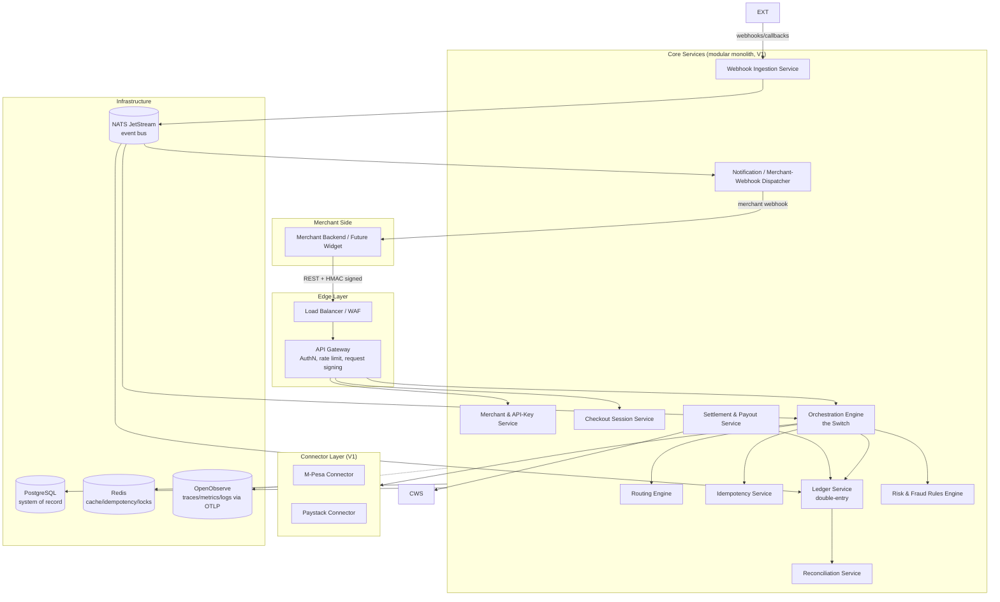
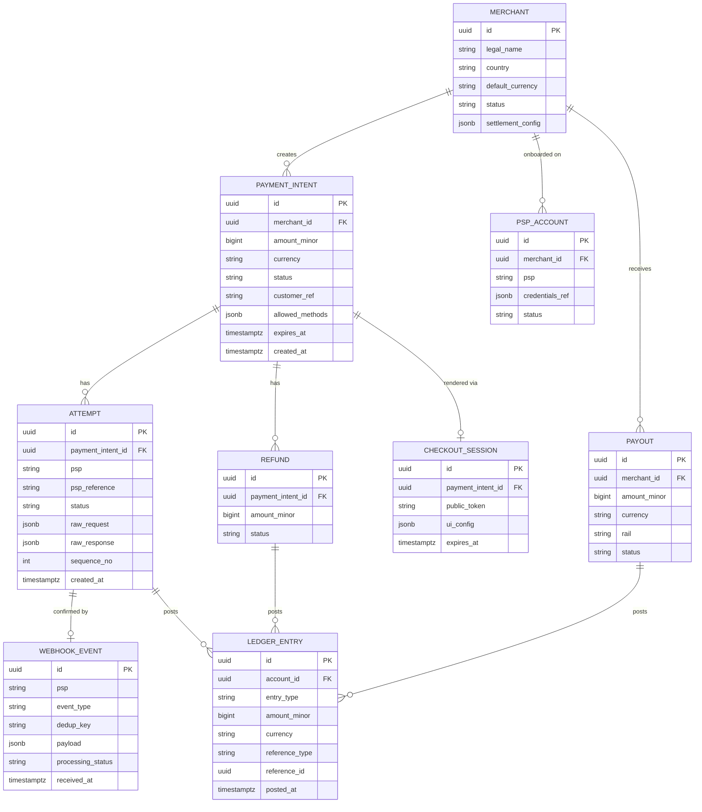
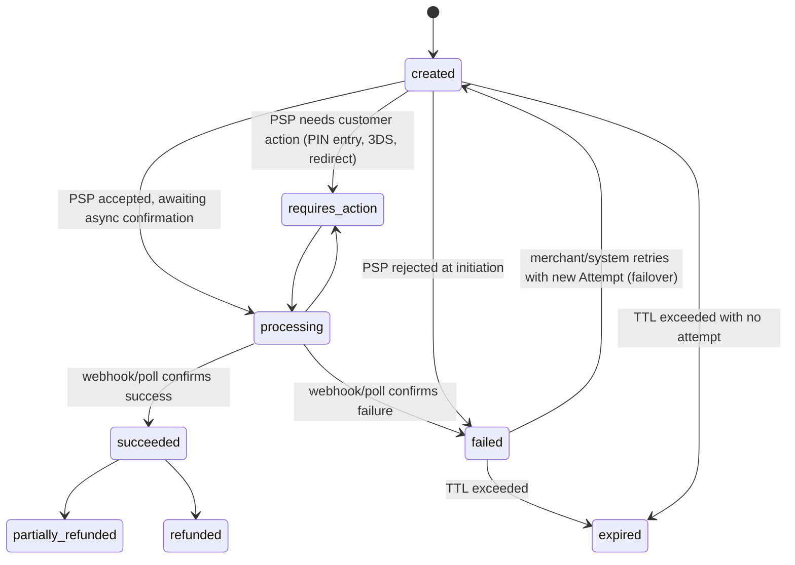
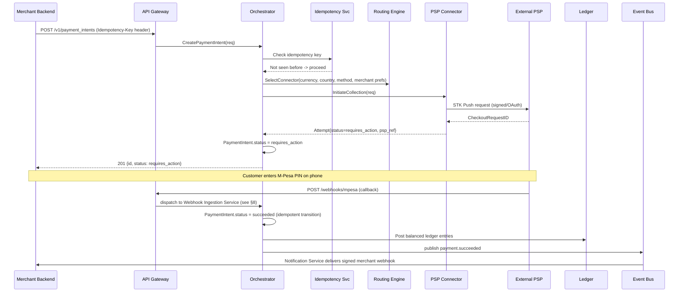
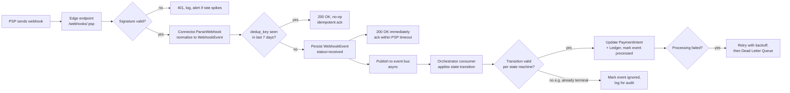

# Payment Aggregator / Switch — Technical Architecture (V1)

**Stack:** Go 1.26
**Forward-looking requirement:** the core must expose a session/token-based API that a future embeddable JS widget can drive without redesign.

---

## 1. Goals & Non-Goals

### 1.1 Goals
- One canonical **Payment Intent** model that abstracts away provider-specific quirks (STK push vs. redirect vs. hosted fields vs. webhook-only confirmation).
- Pluggable **connector** architecture — adding PSP #7 should never touch core orchestration code.
- Built for **idempotency, auditability, and reconciliation** from day one — this is money, not a CRUD app.
- Designed so the *checkout session* concept introduced now becomes the backend for the embeddable widget later, with no breaking API changes.

### 1.2 Non-Goals (V1)
- Becoming a licensed deposit-taking institution or e-money issuer — this system is a **switch/orchestrator**, not a bank. Funds custody/settlement timing must respect each PSP's and Kenya's regulatory model (see §15).
- Card data custody — no raw PAN ever touches our servers (we use Paystack's hosted/inline tokenization for V1; Stripe Elements and PayPal SDK are V2+; see §10).
- Multi-region active-active from day one (designed for, not built for, in V1).

---

## 2. Glossary

| Term | Meaning |
|---|---|
| **Switch** | The core orchestration engine that routes a payment request to the right PSP connector |
| **Connector / Adapter** | Go package implementing a common interface per PSP |
| **Payment Intent** | Our canonical, provider-agnostic record of "merchant wants to collect X amount from a customer" |
| **Charge / Attempt** | One concrete try against one PSP for one Payment Intent (a Payment Intent can have multiple Attempts on retry/failover) |
| **Checkout Session** | A short-lived, pre-configured object the future widget will reference by a public token to render a checkout UI |
| **IPN/Callback/Webhook** | Asynchronous, server-to-server notification of a payment event from a PSP |

---

## 3. High-Level Architecture



**Why a modular monolith for V1, not microservices?** A payment switch's hardest problems (idempotency, ledger consistency, transactional integrity across "charge the customer" + "record the ledger entry" + "notify the merchant") get *easier*, not harder, inside one deployable unit with one database transaction boundary, while you're still validating product-market fit and routing logic. Each box under **Core Services** above is a separate Go package with a clean interface and **owns its own DB schema/tables** — so it can be peeled off into its own microservice later (the **Connector Layer is already isolated this way for the exact same reason — PSP outages must never cascade**) without a rewrite. This is the standard "modular monolith → strangler-fig to microservices" path used by most successful payment platforms in their first 1–2 years.

---

## 4. Core Domain Model

The single most important architectural decision is the **state machine separation between three concepts**:

1. **PaymentIntent** — what the merchant *asked for* (amount, currency, merchant, customer, desired methods). Survives retries.
2. **Attempt (Charge)** — one concrete try with one specific PSP. A PaymentIntent can have N attempts (e.g., Stripe card declined → fallback to Paystack).
3. **LedgerEntry** — the immutable, append-only financial record. Only written once money *actually* moves, never speculatively.



### 4.1 Payment Intent state machine



Key rule: **a PaymentIntent never regresses out of `succeeded`** except through an explicit, separately-ledgered Refund. This protects the ledger from being mutated by late/duplicate webhooks.

### 4.2 Core Go types (system of record, simplified)

```go
package domain

type Currency string // ISO 4217, e.g. "KES", "USD"

type PaymentIntentStatus string

const (
    StatusCreated         PaymentIntentStatus = "created"
    StatusRequiresAction  PaymentIntentStatus = "requires_action"
    StatusProcessing      PaymentIntentStatus = "processing"
    StatusSucceeded       PaymentIntentStatus = "succeeded"
    StatusFailed          PaymentIntentStatus = "failed"
    StatusExpired         PaymentIntentStatus = "expired"
    StatusPartiallyRefund PaymentIntentStatus = "partially_refunded"
    StatusRefunded        PaymentIntentStatus = "refunded"
)

// PaymentIntent is the merchant-facing, provider-agnostic record.
// AmountMinor is always in the smallest currency unit (cents, lowest KES unit)
// to avoid float arithmetic anywhere in the system.
type PaymentIntent struct {
    ID              string
    MerchantID      string
    AmountMinor     int64
    Currency        Currency
    Status          PaymentIntentStatus
    CustomerRef     string
    CustomerPhone   string // for M-Pesa STK
    CustomerEmail   string // for Stripe/PayPal/Paystack
    AllowedMethods  []PaymentMethod
    IdempotencyKey  string
    MetadataJSON    []byte
    ExpiresAt       time.Time
    CreatedAt       time.Time
    UpdatedAt       time.Time
}

type PaymentMethod string

const (
    MethodMpesaSTK PaymentMethod = "mpesa_stk" // routed to M-Pesa connector
    MethodCard     PaymentMethod = "card"       // routed to Paystack in V1; Stripe/PayPal in V2+
)

// Attempt represents one concrete try against one PSP for one PaymentIntent.
type Attempt struct {
    ID              string
    PaymentIntentID string
    PSPReference    string // CheckoutRequestID, PaymentIntent ID, OrderID, etc.
    Status          string
    SequenceNo      int    // for ordering failover attempts
    RawRequest      []byte
    RawResponse     []byte
    CreatedAt       time.Time
    UpdatedAt       time.Time
}

// LedgerEntry is append-only. Never updated, never deleted.
// Double-entry: every business event posts >=2 balanced entries.
type LedgerEntry struct {
    ID            string
    AccountID     string // e.g. "merchant:<id>:available", "psp_clearing:stripe", "platform:fees"
    EntryType     string // "debit" | "credit"
    AmountMinor   int64
    Currency      Currency
    ReferenceType string // "attempt" | "refund" | "payout" | "fee"
    ReferenceID   string
    PostedAt      time.Time
}
```

---

## 5. PSP Connector Layer — the Adapter Pattern


```go
package connector

import "context"

// Connector is implemented once per PSP. Adding a new PSP means writing
// one new file that satisfies this interface — the orchestration engine,
// routing engine, and ledger never change.
type Connector interface {
    // Name returns the canonical PSP identifier, e.g. "mpesa".
    Name() string

    // Capabilities tells the routing engine what this connector can do,
    // so routing decisions are made on real capability, not assumption.
    Capabilities() Capabilities

    // InitiateCollection starts a customer-money-in flow.
    // For STK-style PSPs this triggers the push and returns immediately
    // with status=requires_action; confirmation comes later via webhook.
    // For Stripe/PayPal this creates the PaymentIntent/Order server-side.
    InitiateCollection(ctx context.Context, req CollectionRequest) (CollectionResult, error)

    // GetStatus actively polls the PSP — used as a reconciliation
    // fallback when webhooks are missed (critical for M-Pesa).
    GetStatus(ctx context.Context, pspReference string) (StatusResult, error)

    // Refund issues money back to the customer.
    Refund(ctx context.Context, req RefundRequest) (RefundResult, error)

    // InitiatePayout moves money OUT to a merchant or customer
    InitiatePayout(ctx context.Context, req PayoutRequest) (PayoutResult, error)

    // ParseWebhook verifies signature/authenticity and normalizes the
    // PSP's native callback payload into our canonical WebhookEvent.
    ParseWebhook(ctx context.Context, headers map[string]string, body []byte) (WebhookEvent, error)
}

type Capabilities struct {
    SupportsCollection bool
    SupportsPayout     bool
    SupportsRefund     bool
    SupportedCurrencies []string
    SupportedCountries  []string
    ConfirmationStyle   string // "synchronous" | "webhook_only" | "redirect_then_webhook"
}

type CollectionRequest struct {
    PaymentIntentID string
    AmountMinor     int64
    Currency        string
    Method          string
    CustomerPhone   string
    CustomerEmail   string
    CallbackURL     string
    IdempotencyKey  string
}

type CollectionResult struct {
    PSPReference string
    Status       string // maps to Attempt.Status
    NextAction   *NextAction // e.g. redirect URL for PayPal, or nil for STK (PIN prompt is on-device)
}

type NextAction struct {
    Type string // "redirect" | "display_qr" | "poll"
    URL  string
}

type WebhookEvent struct {
    PSP          string
    EventType    string
    PSPReference string
    DedupKey     string // PSP event ID, or hash of payload if PSP doesn't provide one
    Status       string
    AmountMinor  int64
    Currency     string
    RawPayload   []byte
}
```

### 5.1 Per-PSP connector notes

**V1 (implemented):**

| PSP | Primary use | Auth model | Confirmation style | Key implementation notes |
|---|---|---|---|---|
| **M-Pesa (Daraja)** | Customer collection (KE) + B2C payouts | OAuth2 client-credentials, token cached ~55 min | STK Push is async: initiate → customer enters PIN on-device → Safaricom POSTs callback. No customer-visible redirect. | Use **C2B STK Push (Lipa Na M-Pesa Online)** for collection; **B2C** for refunds/payouts (separate Go-Live approval & `SecurityCredential`). Always run a **nightly Transaction Status reconciliation job** — callbacks are not 100% guaranteed delivery. Phone numbers normalized to `2547XXXXXXXX`. Daraja expects whole KES amounts, not minor units — divide `AmountMinor / 100` before sending. Respond `HTTP 200` to every callback within 30s to avoid Safaricom's aggressive retry storm; ack-then-process-async via NATS. |
| **Paystack** | Customer collection (cards + mobile money, pan-African) | Secret key, Bearer auth | `POST /transaction/initialize` → redirect to Paystack-hosted page or inline popup → `charge.success` webhook is source of truth (poll `/transaction/verify/:reference` as fallback) | Verify webhook via `x-paystack-signature` HMAC-SHA512. Paystack uses the same domain for sandbox and production — the key type (test vs. live) determines the environment. |

**V2+ (planned):**

| PSP | Planned role | Notes |
|---|---|---|
| **Stripe** | Cards/wallets, global | `PaymentIntents` API + Stripe.js/Elements client-side tokenization (no PAN on our servers). Verify webhook via `Stripe-Signature` header + signing secret. |
| **PayPal** | Cards/wallet, international | Orders API v2, redirect/approve/capture. Verify webhook via PayPal's transmission-signature API. |

---

## 6. Orchestration Engine ("the Switch")

This is the only component allowed to change a `PaymentIntent`'s status. It is intentionally a thin, deterministic state-machine executor — all "cleverness" (which PSP to use, retry policy) is delegated to the **Routing Engine** so the orchestration logic itself stays simple and auditable.



### 6.1 Failover logic (within Orchestrator + Routing Engine)

If `Attempt[n]` fails for a *retryable* reason (PSP timeout, 5xx, insufficient float at PSP, generic decline that isn't a hard customer-side decline), the Orchestrator asks the Routing Engine for the **next** candidate connector and creates `Attempt[n+1]` against the **same** `PaymentIntent`. Hard failures (insufficient funds, wrong PIN 3x, card declined as fraud) are **not** retried automatically — they're surfaced to the merchant/customer to act on.

---

## 7. Routing Engine

Routing decisions are config-driven (DB-backed, hot-reloadable), not hardcoded, because routing rules change far more often than code should deploy.

```go
package routing

type RouteRequest struct {
    MerchantID string
    Currency   string
    Country    string
    Method     string // requested method, or "" = let engine decide
    AmountMinor int64
}

type RouteDecision struct {
    Primary   string   // connector name
    Fallbacks []string // ordered fallback chain
    Reason    string   // for observability/audit
}

// Router applies rules in priority order. V1 starts rule-based;
// success-rate-weighted scoring is a natural V2 evolution using the
// same interface (so callers never change).
type Router interface {
    Route(ctx context.Context, req RouteRequest) (RouteDecision, error)
}
```

**V1 rule set (in-memory defaults, hot-reloadable):**

| Priority | Method | Currency | Primary PSP | Fallbacks |
|---|---|---|---|---|
| 1 | `mpesa_stk` | `KES` | `mpesa` | — |
| 2 | `card` | any | `paystack` | — |

Rules are evaluated in priority order; the first match wins. Merchant-specific overrides and additional rails (Stripe, PayPal, Airtel Money) will be added as new rules without touching the engine code — that's the point of the rule-based design.


---

## 8. Webhook Ingestion Architecture

Webhooks are the most failure-prone part of any payment switch (replay attacks, out-of-order delivery, duplicate delivery, PSP retries with no idempotency on their side). The design below assumes **all of the above will happen**.



**Non-negotiable rules:**
1. **Verify signature before doing anything else** — HMAC (Paystack), `Stripe-Signature` (Stripe), transmission-signature API (PayPal), and IP-allowlist + shared-secret/IPN-token checks for M-Pesa which don't sign payloads as strongly.
2. **Always ACK fast, process async.** Safaricom in particular retries aggressively on non-200 or slow responses — the edge handler's only job is verify → dedupe → persist → 200. Business logic happens in a consumer off the event bus.
3. **Dedup key** = PSP's own event/transaction ID when available, else a stable hash of `(psp, pspReference, eventType, amount)`.
4. **State machine guards every transition** — a duplicate or late "succeeded" webhook arriving after a Refund has already been processed is a no-op, never a regression.
5. **Reconciliation job** (cron, hourly + full nightly run) calls `Connector.GetStatus` for every `Attempt` still `processing` past a threshold — this is what protects against missed webhooks entirely, which *will* happen with M-Pesa at some point.

---

## 9. Ledger & Settlement

### 9.1 Double-entry ledger
Every money movement posts **at least two balanced LedgerEntry rows** (sum of debits = sum of credits), e.g.:

- Customer pays KES 1,000 via M-Pesa → `debit psp_clearing:mpesa 1000` / `credit merchant:<id>:available 1000` minus platform fee, which itself is `debit merchant:<id>:available <fee>` / `credit platform:fees <fee>`.
- This is the same model used by Stripe's own internal ledger and most serious fintech ledgers — it makes "where did the money go" a query, not an investigation, and it's what your auditors/regulators will ask for first.

### 9.2 Settlement & Payout Service
Decoupled from the collection path entirely. Runs on a schedule (e.g. T+1, configurable per merchant) or on-demand:
1. Sum each merchant's `available` ledger balance per currency.

### 9.3 Reconciliation Service
Nightly job per PSP:
- Match against our `Attempt`/`Payout` records by `psp_reference`.
- Flag: amount mismatches, orphaned PSP transactions (PSP has it, we don't — usually a missed webhook), orphaned local transactions (we have it, PSP doesn't — usually a failed-but-recorded-as-success bug) into an **exceptions queue** a human reviews. This single job is what catches the bugs that "passed all tests."

---

## 10. Security Architecture

| Layer | Control |
|---|---|
| **PCI DSS scope minimization** | Card PAN never reaches our backend. Stripe Elements / Paystack inline-iframe / PayPal SDK tokenize client-side; we only ever see PSP-issued tokens/PaymentIntent IDs. This keeps us at **SAQ A** scope, not full PCI DSS Level 1 infra. |
| **Secrets** | Local dev: `.env` file (never committed). Production: Helm `Secret` (rendered from `values.yaml` or a pre-existing secret managed by Sealed Secrets / External Secrets Operator). PSP keys, HMAC signing secret, and DB credentials are never baked into images or ConfigMaps. |
| **Transport** | TLS 1.2+ everywhere; mTLS between internal services once split beyond the monolith. |
| **Merchant API auth** | API key (public/secret pair) + **HMAC request signing** (timestamp + nonce + body hash) to prevent replay, mirroring how the future widget's public tokens will work. |
| **Webhook auth** | Per-PSP signature verification (§8) + IP allowlisting where the PSP publishes static egress IPs (M-Pesa). |
| **Data at rest** | Column-level encryption for PII (phone numbers, emails) using envelope encryption via KMS; full-disk encryption on all volumes. |
| **AuthZ** | RBAC for internal dashboard/ops users; merchants are tenant-isolated at the query layer (every query scoped by `merchant_id`, enforced via Postgres Row-Level Security as a second line of defense). |
| **Audit trail** | Every state transition, every webhook received, every manual ops action is append-only logged with actor + reason — required for dispute handling and regulator requests. |

---

## 11. Tech Stack

| Concern | Choice | Why |
|---|---|---|
| Language | Go 1.26 | Concurrency model fits high-throughput I/O-bound webhook/PSP traffic; static typing matters a lot for money code |
| HTTP framework | `chi` + `net/http` middleware | Minimal magic, easy to audit |
| Database | PostgreSQL 15+ | ACID transactions for ledger integrity; JSONB for flexible PSP raw-payload storage |
| Cache / locks / idempotency store | Redis 7+ | Idempotency key cache, distributed locks for "don't double-process this webhook", dedup store |
| Event bus | NATS JetStream | Decouples webhook ingestion from orchestration; the `worker` binary consumes asynchronously |
| Secrets | `.env` (local) / Helm `Secret` (production) | Sensitive config is never in ConfigMaps or images; supports Sealed Secrets / External Secrets Operator |
| Background jobs | NATS JetStream consumer (`cmd/worker`) + `cmd/cron` runner | Worker handles webhook events; cron handles reconciliation, settlement, token refresh |
| Observability | OpenTelemetry → **OpenObserve** (OTLP for traces, metrics, logs) | Single backend; trace a payment from API → orchestrator → connector → webhook → ledger |
| Deployment | Docker + Helm + **ArgoCD** (GitOps) | Helm chart manages ConfigMap + Secret split; ArgoCD syncs from git; HPA + PDB configured out of the box |
| CI/CD | GitHub Actions; mandatory ledger-balance invariant tests | A failed "debits == credits" test blocks deploy |

---

## 12. Project Structure

```
zia/
├── cmd/
│   ├── api/                  # HTTP API server entrypoint
│   ├── worker/               # NATS JetStream consumer (webhook processing, notifications)
│   └── cron/                 # scheduled jobs (reconciliation, settlement, M-Pesa token refresh)
├── internal/
│   ├── api/                  # HTTP handlers: portal, merchant, payment_intent, checkout, webhook
│   ├── authn/                # API key authentication middleware
│   ├── domain/               # core types: PaymentIntent, Attempt, LedgerEntry, Merchant, User, etc.
│   ├── orchestrator/         # the Switch — state machine, no PSP-specific code
│   ├── routing/              # rule-based routing engine + circuit breaker
│   ├── idempotency/          # Redis-backed idempotency store
│   ├── ledger/               # double-entry posting logic, balance queries
│   ├── reconciliation/       # nightly reconciliation runner
│   ├── settlement/           # settlement & payout runner
│   ├── webhook/              # ingestion dedup, NATS publish, processor
│   ├── notification/         # outbound merchant-webhook dispatcher
│   ├── risk/                 # lightweight rules engine (velocity, thresholds, blocklists)
│   ├── repository/           # DB access layer (pgx/v5): one file per domain
│   ├── service/              # PaymentIntent service (orchestrates repo + orchestrator)
│   └── connector/
│       ├── connector.go      # Connector interface + shared types (§5)
│       ├── registry.go       # runtime connector registry
│       ├── mpesa/            # M-Pesa Daraja: auth, STK push, B2C, webhook parsing
│       └── paystack/         # Paystack: initialize, verify, webhook parsing
├── pkg/
│   ├── httpsign/             # HMAC request signing helpers (shared client + server)
│   ├── moneyutil/            # minor-unit arithmetic helpers, no floats anywhere
│   └── phoneutil/            # E.164 phone normalization (e.g. 0712 → 254712)
├── migrations/               # golang-migrate SQL files (up + down)
├── helm/                     # Helm chart: ConfigMap + Secret split, HPA, PDB, ingress
├── argocd/                   # ArgoCD Application manifests
├── api-tests/                # Postman collection for manual/smoke testing
├── Dockerfile
├── docker-compose.yml        # local dev: Postgres, Redis, NATS, OpenObserve
├── Makefile
└── .env.example
```

Each `connector/<psp>/` package is self-contained: its own HTTP client, its own auth/token management, its own webhook parser, and a single exported type satisfying `connector.Connector`. Adding a new PSP is a single new folder — the orchestrator, routing engine, and ledger never change.

---

## 13. API Design (merchant-facing) — and the on-ramp to the widget

### 13.1 Core REST endpoints (V1)

| Method & Path | Purpose |
|---|---|
| `POST /v1/payment_intents` | Create a payment intent (the merchant's backend calls this) |
| `GET /v1/payment_intents/:id` | Poll status |
| `POST /v1/payment_intents/:id/confirm` | For methods needing an explicit confirm step (e.g. after redirect-based PayPal approval) |
| `POST /v1/payment_intents/:id/refunds` | Full/partial refund |
| `GET /v1/transactions` | List/filter, for merchant reconciliation/dashboards |
| `POST /v1/checkout_sessions` | **Forward-looking:** creates a Checkout Session + short-lived public token the widget will use |
| `GET /v1/checkout_sessions/:token` | **Public, unauthenticated** (token-scoped) — what the widget calls to render the right UI/methods |
| `POST /v1/webhooks/:psp` | Inbound, PSP→us |
| Merchant-configured webhook URL | Outbound, us→merchant, HMAC-signed, with exponential-backoff retry + a "replay this event" ops tool |

### 13.2 Designing for the widget *now*

Since the widget is coming next, the **Checkout Session** abstraction is introduced in V1 specifically so the widget integration later requires **zero backend redesign** — only a new frontend:

1. Merchant backend creates a `PaymentIntent`, then a `CheckoutSession` referencing it, gets back a `public_token` (short TTL, single-use, no merchant secret embedded).
2. Merchant's page embeds `<script src=".../widget.js" data-token="...">` (future deliverable).
3. Widget calls `GET /v1/checkout_sessions/:token` — a **public**, rate-limited, token-scoped endpoint — to learn which methods to render (e.g. "this customer is in Kenya, show M-Pesa + card").
4. Widget collects only what each method needs (phone number for STK, or hands off to Stripe.js/Paystack inline/PayPal SDK for tokenized card/wallet entry) and calls `confirm` — never touching merchant secret keys, never touching raw card data.
5. Widget polls or opens a WebSocket/SSE channel scoped to the session for real-time status (critical for STK push's "waiting for PIN entry" UX) — design the `CheckoutSession` table and event bus topic now so this is additive later, not retrofitted.

This is exactly the **Stripe PaymentIntent + Stripe.js / Elements pattern** and the **Paystack inline popup pattern** — proven, and it composes naturally with the multi-PSP router underneath since the widget never needs to know which PSP actually services a given method.

---

## 14. Risk & Fraud (V1 — rules-based, not ML)

A lightweight `risk` module runs synchronously before `InitiateCollection`:
- Velocity checks (same customer phone/email/IP exceeding N attempts per minute/hour).
- Amount-threshold review queue (large transactions flagged for manual review before settlement, not before collection — don't block legitimate customers).
- Basic deny-list (phone numbers/emails/cards previously charged back or confirmed fraudulent).
- Per-merchant configurable risk thresholds, since a KES 50 merchant and a KES 5M merchant have very different "normal."

This is intentionally simple for V1; the `risk.Engine` interface should be designed so a future ML scoring service is just a new implementation behind the same interface.

---

## 15. Compliance & Regulatory Considerations

> This is **not legal advice** — confirm specifics with Kenyan counsel and each PSP's partnership team before going live. The points below are architectural implications of real, well-known regulatory facts.

- **CBK / National Payment System Act:** Operating a switch that touches M-Pesa rails for *other merchants* (i.e., as a payment service provider/aggregator, not your own e-commerce checkout) typically requires registration/authorization with the **Central Bank of Kenya** under the National Payment System Act/Regulations once you go beyond a single-merchant integration. Architect merchant onboarding/KYC (§ below) and segregated client-fund ledgering now so you're not retrofitting compliance later.
- **Segregated/Pass-through funds:** Treat all merchant collections as **client funds, not platform revenue**, on the ledger (separate top-level account hierarchy: `platform:*` vs `merchant:*:available`). This is both good architecture and typically a regulatory expectation for aggregators.
- **PCI DSS:** SAQ A scope as long as no raw card data is ever transmitted/stored/processed on our infra (enforced by always using PSP-hosted tokenization — §10).
- **KYC/AML on merchant onboarding:** A `merchant.onboarding` module (out of core scope for this document, but a hard dependency before go-live) collecting business registration, beneficial ownership, and screening against sanctions lists before a `PSP_ACCOUNT` is activated.
- **Data residency:** If regulation requires Kenyan transaction data to stay in-country, design the data layer so PII/transaction records for KE-rail payments can be pinned to an in-region DB without architectural rework (i.e., don't hardcode a single global Postgres instance into application logic — go through a repository layer).
- **GDPR / data protection (Kenya's DPA 2019 mirrors much of GDPR):** PII encryption (§10), data subject deletion/export support designed into the schema from day one (don't hard-delete ledger entries — use anonymization where legally required for older PII while preserving immutable financial records).

---

## 16. Observability & SRE

- **Distributed tracing** (OpenTelemetry): one trace ID per `PaymentIntent`, propagated through every Attempt, webhook, and ledger post — so "what happened to payment X" is one Grafana/Tempo query, not a grep across five services.
- **Key metrics:** success rate per PSP per method, P50/P95/P99 time-to-confirmation per PSP (STK push will be much slower than card capture — alert thresholds must differ per method), webhook processing lag, reconciliation exception count, circuit-breaker state per connector.
- **Alerting:** PagerDuty/Slack on: webhook signature-failure spikes (possible attack), reconciliation exceptions above threshold, any connector circuit breaker opening, ledger imbalance (debits ≠ credits — this should be a **page-immediately** severity-1, not a dashboard).
- **SLOs:** define explicit targets, e.g. "99.9% of webhook events processed within 5s of receipt," "99.5% of payment intents reach a terminal state within their PSP's expected window."

---

## 17. Testing Strategy

- **Ledger invariant tests:** property-based tests asserting sum(debits) == sum(credits) after every simulated event sequence, including out-of-order and duplicate webhook delivery.
- **Chaos/failover tests:** simulate a PSP timing out or returning 5xx mid-flow and assert the Routing Engine correctly fails over and the customer is never double-charged.
- **Idempotency tests:** fire the same merchant request / same webhook twice (and out of order) and assert single ledger effect.
- **Webhook replay tooling:** an internal ops endpoint to replay a stored webhook payload against a sandbox-flagged merchant, for support/debugging.

---

## 18. Roadmap Beyond V1

| Phase | Scope |
|---|---|
| **V1 (current)** | M-Pesa (STK Push + B2C) + Paystack (cards/mobile money); server-to-server API; merchant portal; modular monolith; rule-based routing; ArgoCD/Helm deployment |
| **V2** | Stripe (cards/wallets, global) + PayPal (Orders API v2); embeddable JS checkout widget built on the existing Checkout Session API; hosted checkout page fallback |
| **V3** | Success-rate/cost-weighted smart routing (data-driven, same `Router` interface); Airtel Money and additional African card processors; KYC/AML merchant onboarding module |
| **V4** | Extract Connector Layer and Ledger Service into independently deployed services if/when scale demands it; multi-region active-active; on-prem/private connectivity for large merchants |

---

## 19. Summary of Key Architectural Decisions

1. **Provider-agnostic core, provider-specific edges** — the `Connector` interface is the seam that keeps the system extensible.
2. **Three-tier state model** (PaymentIntent → Attempt → LedgerEntry) so retries/failover never corrupt financial truth.
3. **Modular monolith now, microservices-ready later** — boundaries are real (separate packages/schemas), deployment is simple.
4. **Webhooks are untrusted input** — verify, dedupe, ack-fast-process-async, and never trust them as the *only* source of truth (reconciliation jobs are mandatory, not optional, especially for M-Pesa).
6. **Checkout Sessions exist from V1** specifically so the embeddable widget is a frontend project next, not a backend redesign.